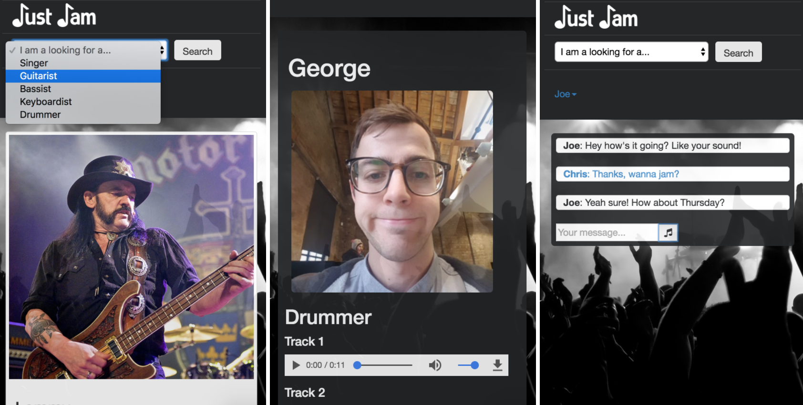

# Just Jam

#### Find your musical soulmates!



Just Jam is a mobile responsive web app that connects musicians looking to start a band together.

Users can sign up, create their own profile and upload sound clips of themselves. They can then search for other users and if they like what they hear can start a chat and organise a jam session.

Use it on Heroku [here](http://just-jam.herokuapp.com/).

Just Jam was built by [George Eaton](https://github.com/gweaton), [Chris Cooper](https://github.com/cjcoops), [Jenna Ramdenee]( https://github.com/jennaramdenee) and [Rory Grieve](https://github.com/rorygrieve) in 8 days as our final project at Makers Academy.

## Built With

 - Node.js
 - Express.js
 - Mongoose
 - MongoDB
 - JavaScript
 - Socket.io
 - Pug, CSS & Bootstrap

### Testing

 - Mocha
 - Chai
 - Sinon
 - Zombie.js

### Objectives

### Process

### Struggles

### Successes

### User stories
** MVP **

```
As a musician
So that I can find other musicians to jam with
I want to see a list of other musicians

As a musician
So that other musicians can find me
I want to create a profile

As a musician
So that I can find out more about a musician
I want to view their profile
```

** Remaining **

```
As a musician
So that I can ensure security
I want to log in and out of the app

As a musician
So that I can join
I want to sign up

As a musician
So that I can showcase my musical ability
I want to upload an audio track to my profile

As a musician
So that I can show people what I look like
I want to upload a photo to my profile

As a musician
So that I can change my profile at a later date
I want to be able to edit my profile

As a musician
So that I can get in touch with other musicians
I want to chat with them

As a musician
So that I can remember who I have chatted with
I want to see a list of all my chats

As a musician
So that I can review conversation history
I want to see previously sent messages in a chat

As a musician
So that I can find a particular type of musician
I want to search Jammers by instrument

As admin
To ensure that only official users chat
I want to prevent users that have not signed up or logged in from starting a chat

As admin
To ensure that only official users connect
I want to prevent users that have not signed up or logged in from creating a profile

As admin
To ensure an effective search of Jammers
I want to prevent users from seeing their own profile in search results

```

** Future **
```
As a musician
So that I can find a musician located near me
I want to filter a search by location

As a musician
So that I can showcase all the instruments I play
I want to list more than one instrument in my profile

As a musician
So that I can showcase all my music
I want to integrate videos in my profile
```
